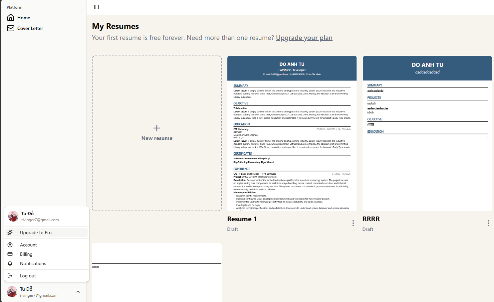
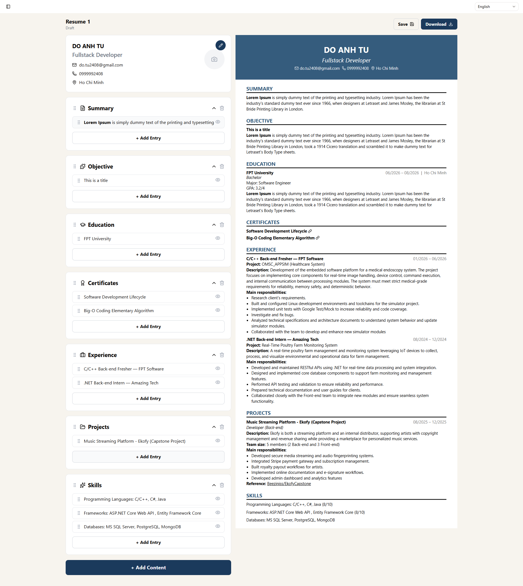
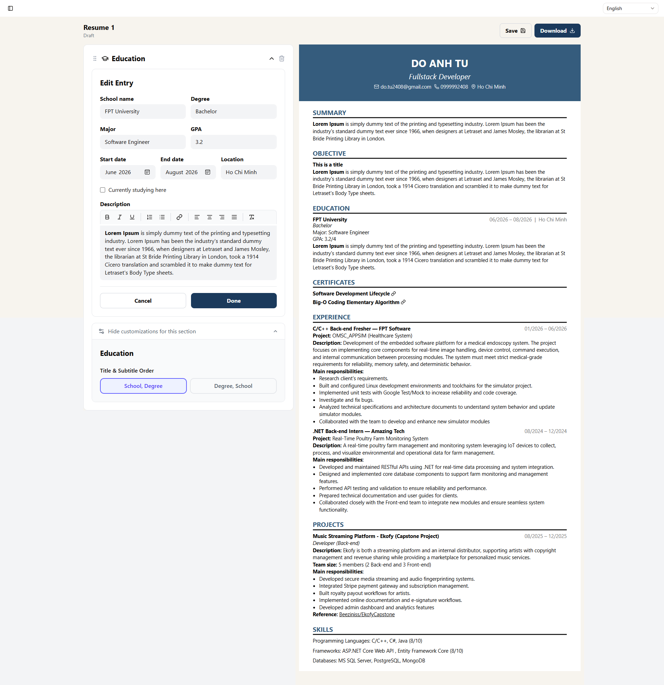
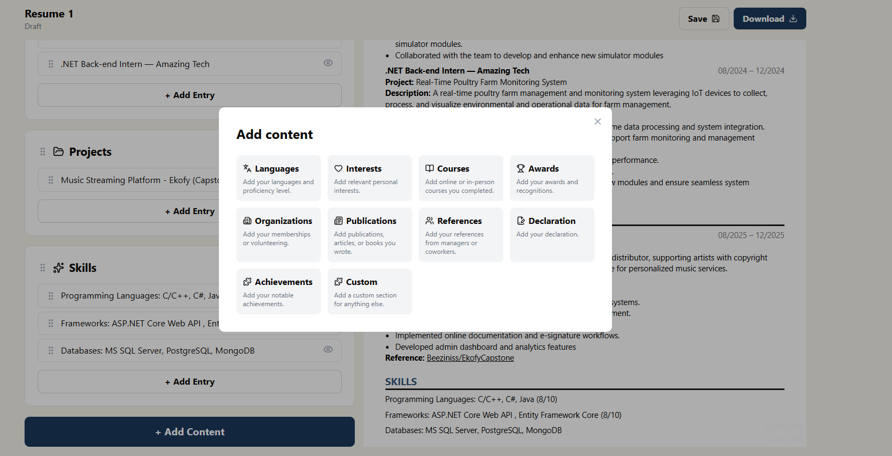

<div align="center">
  

  # ResumeBuilder

  A web app for building, editing, and exporting professional resumes/cover letters right in the browser, with a realtime preview and PDF export.

  
  
  
  

  English | [Tiếng Việt](#tiếng-việt)
</div>

## Overview

ResumeBuilder is a personal project built to practice Clean Architecture on a .NET backend and modern Angular on the frontend, while also producing something genuinely useful: a tool that lets users build a resume section by section (personal information, objective, education, experience, project, skill, language, certificate...), reorder everything by drag-and-drop, preview changes in real time, and export the result as a PDF.

## Screenshots

<p align="center">
  <br>
  <sub>Dashboard — manage all your resumes in one place</sub>
</p>

<p align="center">
  <br>
  <sub>Section-based editor with realtime preview</sub>
</p>

<table>
<tr>
<td width="50%"><br><sub>Per-section layout customization (Education)</sub></td>
<td width="50%"><br><sub>Extra content blocks: languages, courses, awards, references...</sub></td>
</tr>
</table>

## Key features

- **Authentication**: register, login, Google sign-in, refresh token, JWT.
- **Multiple resumes**: create, edit, and delete multiple resumes per account.
- **Section-based editor**: Personal Information, Objective, Summary, Education, Experience, Project, Skill, Language, Certificate — each with its own editor.
- **Reordering**: drag-and-drop to reorder sections and entries within a section.
- **Realtime preview**: form changes are reflected on the preview instantly.
- **PDF export**: export the finished resume to PDF using QuestPDF.
- **Thumbnails**: auto-generated thumbnail image for each resume.
- **Cover letter**: write a cover letter alongside the resume.

## Architecture & tech stack

### Backend — `Back-end/ResumeBuilderSolution`

Built with **Clean Architecture**, split into separate layers:

```
ResumeBuilder.Api             # Presentation layer — controllers, middlewares
ResumeBuilder.Application     # Use cases (CQRS via MediatR), validation, mapping
ResumeBuilder.Domain          # Entities, interfaces, pure business rules
ResumeBuilder.Infrastructure  # Auth, PDF generation, external integrations
ResumeBuilder.Persistence     # EF Core, repositories, migrations
```

Stack:
- **.NET 10** / ASP.NET Core Web API
- **MediatR** — CQRS pattern for feature-based use cases
- **FluentValidation** — request validation
- **Mapster** — entity/DTO mapping
- **Entity Framework Core** + **Npgsql** (PostgreSQL)
- **JWT Bearer** + **Google OAuth** for authentication
- **BCrypt.Net** — password hashing
- **QuestPDF** — PDF generation from resume data
- **AngleSharp** — HTML processing for thumbnails/PDF
- **Swashbuckle (Swagger)** — API documentation
- **Docker** support

### Frontend — `Front-end/ResumeBuilder`

- **Angular 21** (standalone components)
- **Tailwind CSS 4**
- **Spartan-ng** (shadcn-style UI primitives for Angular)
- **Tiptap** — rich text editor for resume content
- **Lucide / FontAwesome** — icons
- **Axios** — API calls
- **Embla Carousel**, **ngx-scrollbar** — supporting UI

Main folder structure:

```
src/app/
├── core/          # app-wide guards, interceptors, services
├── features/      # authentication, homepage, resume, cover-letter
└── shared/        # shared components, models, utils, validators
```

## Getting started

### Prerequisites

- .NET 10 SDK
- Node.js + npm
- PostgreSQL

### Run the backend

```bash
cd Back-end/ResumeBuilderSolution
dotnet restore
dotnet ef database update --project ResumeBuilder.Persistence --startup-project ResumeBuilder.Api
dotnet run --project ResumeBuilder.Api
```

Configure the connection string, JWT secret, Google OAuth client, etc. in `appsettings.Development.json` or a `.env` file (the project uses `DotNetEnv`).

### Run the frontend

```bash
cd Front-end/ResumeBuilder
npm install
npm start
```

The frontend runs at `http://localhost:4200` by default; the backend address is configured in Swagger (`/swagger`).

## Roadmap

- Once funding allows, deploy ResumeBuilder to a public, always-on environment and release it as a free tool for everyone — especially students who need a quick, no-cost way to put together a professional resume.

## License

Released under the [MIT](LICENSE) license.

---

<a id="tiếng-việt"></a>

## Tiếng Việt

<div align="center">

  [English](#resumebuilder) | Tiếng Việt

</div>

### Giới thiệu

ResumeBuilder là dự án cá nhân mình xây dựng để luyện tập kiến trúc Clean Architecture cho backend .NET và Angular hiện đại cho frontend, đồng thời tạo ra một công cụ thực tế: cho phép người dùng soạn CV theo từng phần (thông tin cá nhân, mục tiêu, học vấn, kinh nghiệm, dự án, kỹ năng, ngôn ngữ, chứng chỉ...), sắp xếp lại thứ tự bằng kéo-thả, xem trước theo thời gian thực và xuất ra file PDF.

### Hình ảnh minh họa

<p align="center">
  <br>
  <sub>Trang Dashboard — quản lý tất cả CV của bạn tại một nơi</sub>
</p>

<p align="center">
  <br>
  <sub>Trình soạn thảo theo section, xem trước realtime</sub>
</p>

<table>
<tr>
<td width="50%"><br><sub>Tùy chỉnh layout riêng cho từng section (Education)</sub></td>
<td width="50%"><br><sub>Các khối nội dung bổ sung: ngôn ngữ, khóa học, giải thưởng, người tham chiếu...</sub></td>
</tr>
</table>

### Tính năng chính

- **Xác thực người dùng**: đăng ký, đăng nhập, đăng nhập bằng Google, refresh token, JWT.
- **Quản lý nhiều CV**: tạo, chỉnh sửa, xóa nhiều bản CV cho một tài khoản.
- **Trình soạn thảo theo section**: Personal Information, Objective, Summary, Education, Experience, Project, Skill, Language, Certificate — mỗi section có editor riêng.
- **Sắp xếp lại (Reorder)**: kéo-thả để đổi thứ tự section và entry trong từng section.
- **Xem trước realtime**: thay đổi ở form được phản ánh ngay trên bản xem trước.
- **Xuất PDF**: xuất CV hoàn chỉnh ra file PDF bằng QuestPDF.
- **Thumbnail**: tự sinh ảnh thu nhỏ cho từng CV.
- **Cover Letter**: soạn thư xin việc đi kèm CV.

### Kiến trúc & công nghệ

#### Backend — `Back-end/ResumeBuilderSolution`

Xây dựng theo **Clean Architecture**, tách thành các layer riêng biệt:

```
ResumeBuilder.Api             # Presentation layer — Controllers, middlewares
ResumeBuilder.Application     # Use cases (CQRS với MediatR), validation, mapping
ResumeBuilder.Domain          # Entities, interfaces, business rules thuần
ResumeBuilder.Infrastructure  # Xác thực, sinh PDF, tích hợp bên ngoài
ResumeBuilder.Persistence     # EF Core, repository, migrations
```

Công nghệ sử dụng:
- **.NET 10** / ASP.NET Core Web API
- **MediatR** — CQRS pattern cho use case theo từng feature
- **FluentValidation** — validate request
- **Mapster** — mapping giữa entity/DTO
- **Entity Framework Core** + **Npgsql** (PostgreSQL)
- **JWT Bearer** + **Google OAuth** cho xác thực
- **BCrypt.Net** — mã hóa mật khẩu
- **QuestPDF** — sinh file PDF từ CV
- **AngleSharp** — xử lý HTML khi sinh thumbnail/PDF
- **Swashbuckle (Swagger)** — tài liệu API
- Hỗ trợ chạy bằng **Docker**

#### Frontend — `Front-end/ResumeBuilder`

- **Angular 21** (standalone components)
- **Tailwind CSS 4**
- **Spartan-ng** (bộ UI primitives phong cách shadcn cho Angular)
- **Tiptap** — rich text editor cho các phần nội dung CV
- **Lucide / FontAwesome** — icon
- **Axios** — gọi API
- **Embla Carousel**, **ngx-scrollbar** — UI phụ trợ

Cấu trúc thư mục chính:

```
src/app/
├── core/          # guard, interceptor, service dùng chung toàn app
├── features/      # authentication, homepage, resume, cover-letter
└── shared/        # component, model, util, validator dùng chung
```

### Bắt đầu

#### Yêu cầu

- .NET 10 SDK
- Node.js + npm
- PostgreSQL

#### Chạy backend

```bash
cd Back-end/ResumeBuilderSolution
dotnet restore
dotnet ef database update --project ResumeBuilder.Persistence --startup-project ResumeBuilder.Api
dotnet run --project ResumeBuilder.Api
```

Cấu hình connection string, JWT secret, Google OAuth client... trong `appsettings.Development.json` hoặc file `.env` (dự án dùng `DotNetEnv`).

#### Chạy frontend

```bash
cd Front-end/ResumeBuilder
npm install
npm start
```

Ứng dụng frontend mặc định chạy tại `http://localhost:4200`, backend tại địa chỉ cấu hình trong Swagger (`/swagger`).

### Định hướng tương lai

- Nếu sau này có điều kiện tài chính, mình dự định sẽ deploy ResumeBuilder lên môi trường public và phát hành miễn phí cho mọi người dùng, đặc biệt hướng đến đối tượng sinh viên — những người cần một công cụ nhanh, không tốn phí để tạo CV chuyên nghiệp.

### License

Phát hành theo giấy phép [MIT](LICENSE).
